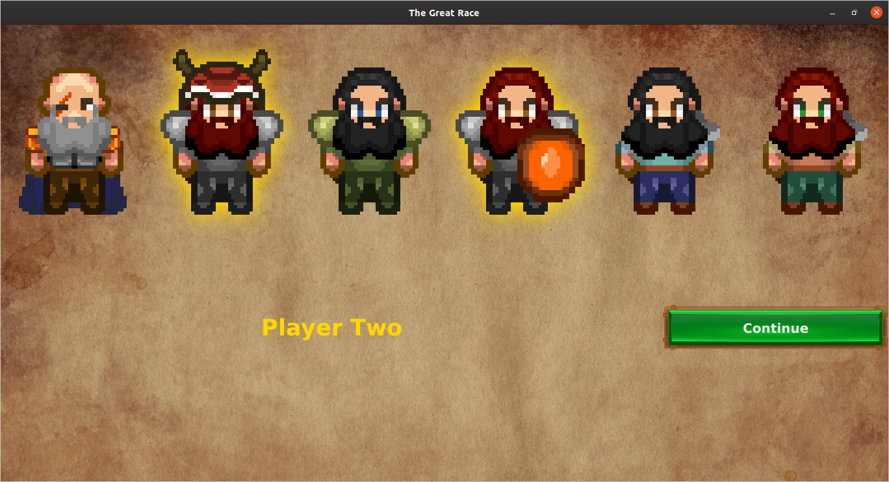
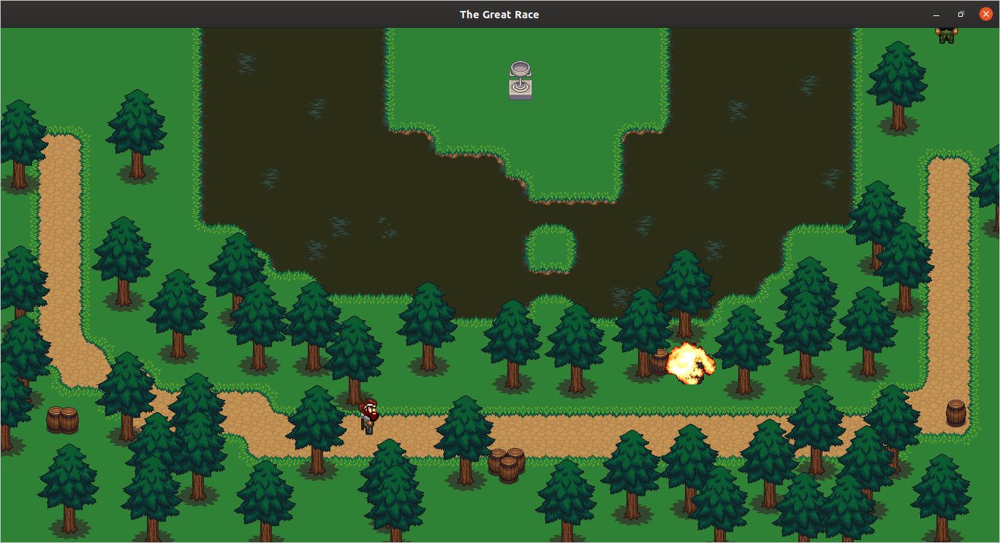
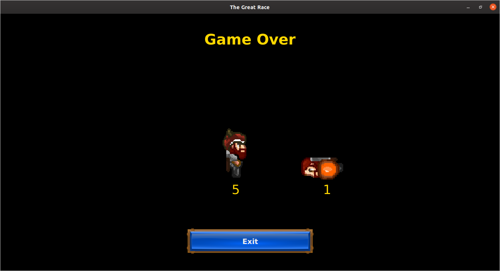

## The Game

I originally wrote this for a CS assignment. The assignment was later canceled, but the game was looking good, so I finished it up over the rest of the semester. My main regret is the amount of hardcoding around the sprite functionality. Ideally this should probably be in some sort of metafile. Oh well.

The game is a two-player, top-down, race-to-the-goal sort of game. "Two-player," unfortunately, means that two players play on one computer, sharing a single keyboard (one player uses WASD+C, the other, IJKL+N). I'm not sure why, but this means that one player can "hoard" the keyboard by pressing several keys down at once. The rendering is pretty slick, I think. It's a little better than 2D, since players can walk "behind" and "in front of" each other and obstacles.

## Requirements

I haven't figured out JAR creation, so you'll have to compile the code yourself. You'll also have to install [JavaFX](https://openjfx.io/). Get the latest version; versions earlier than 12 will not work as they don't provide `GraphicsContext#setImageSmoothing`.

## Compiling

Either download the source or clone the repository with Git. I've used Ant throughout development, and to save time, you should too. You can run `ant compile` to compile the code. You'll need to set `$JAVAFX_HOME` to your JavaFX installation directory before this will work. Here's the UNIX method:

```
$ export JAVAFX_HOME= # wherever you installed JavaFX, e.g. /usr/local/src/javafx-sdk-13.0.2/
$ ant compile
*compile compile*
```

## Playing

After compiling, just run `ant game` to play the game, or `ant mapmaker` to design new levels. Actually, running either of these tasks will call `ant compile` under the hood.

The goal of the game is to be the first to reach the goal, which is rendered as a cup. The maps never change, so once you've got the hang of the controls and memorized the maps, you're pretty much unbeatable!

## Assets
See [credits.txt](src/assets/credits.txt).

## Screenshots
Actual gameplay.





